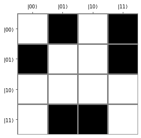
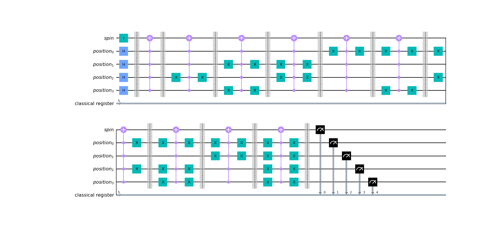

# Ising Quantum Image Processing

This repository contains a toy project in which we tackle the question of whether quantum embeddings can be any useful for solving various tasks on classical spin systems (like the Ising model, percolation, etc...).

The data generation part for the Ising configurations is written in C++ and uses the Metropolis-Hastings algorithm.

The quantum embedding and quantum kernel estimation is written in python and leverages on IBM's qiskit library.

## Requirements

* c++17
* python 3.8.10
* matplotlib
* tqdm
* multiprocessing
* numpy
* ipykernel
* qiskit

## Installation

```shell
pip install -e .
```

## Context

### Quantum Embedding

Here is $4\times 4$ lattice representing a configuration of the Ising model.



The idea is to encode an Ising configuration in a quantum state, in an economical way in terms of the number of required qubits.
Let us denote by $L$ the size of the square lattice. Let us denote $q :=\lceil\log_2L\rceil$. The number of required qubits in the quantum embedding discussed here is $n:=2q+1$, corresponding to $q$ qubits for the horizontal location, $q$ qubits for the vertical location, and $1$ 'spin qubit' containing the information on the binary value of the spin at a given location.

Initially the state $|0\rangle^{\otimes n}$ is acted upon by $I\otimes H^{2q}$, where $H$ is the Hadamard gate, in order to produce a fully entangled state, with the spin qubit untouched. One obtains the following state:
$|0\rangle\otimes\sum_{i=0,\dots,2^{2q}-1}|i\rangle$. Remains to implement a flip gate on the spin qubit whenever the spin at the location specific location if $+1$, and leave it untouched when the corresponding spin it $-1$. This is implemented by a controlled $X$ gate. The quantum circuit corresponding to the above Ising configuration is for instance given by:



From the quantum circuit, on can then extract a state vector from measurement statistics. Let us denote by $x$ some spin configuration in the dataset. One therefore associates to it a pure $|\psi(x)\rangle=\mathcal U(x)|0\rangle^{\otimes n}$, or alternatively the rank-1 density matrix $\rho(x)=|\psi(x)\rangle\langle\psi(x)|$.

### Kernel Ridge Regression and quantum kernel estimation

Let us focus on the regression task which consists in predicting the temperature corresponding to a given spin configuration. For instance, the spin configuration displayed above corresponds to a temperature $T=2.7$ (the Boltzmann constant $k_\text{B}$ is set equal to $1$).

More precisely, we wish to compare the relative performance of Kernel Ridge Regression using a standard RBF (Gaussian) kernel and a quantum kernel. The classical kernel between to datapoints is defined as $k_\text{c}(x, y)=\exp\left(-\gamma\lVert x-y\rVert^2\right)$ where $\lVert\cdot\rVert$ denotes the $L^2$. The quantum kernel instead is defined by $k_\text{q}(x, y)=\exp\left(-\gamma\lVert \rho(x)-\rho(y)\rVert^2_\text{F}\right)$, where $\lVert\cdot\rVert_\text{F}$ denotes the Frobenius norm, and derives from the inner product $\langle\rho_1,\rho_2\rangle:=\text{Tr}\left(\rho_1^\dagger\rho_2\right)$.

Massaging a little bit the definition of the quantum kernel, using the definition of the Frobenius norm and the fact that the states are normalized, we can rewrite it as $k_\text{q}(x, y)=\exp\left[-2\gamma\left(1-\langle\psi(x)|\psi(y)\rangle^2\right)\right]$.

The quantum linear kernel $\langle\psi(x)|\psi(y)\rangle=\langle0|\mathcal U^\dagger(x)\mathcal U(y)|0\rangle$ can be estimated with the following procedure: evolve the initial state $|0\rangle^{\otimes n}$ through the unitary gate $\mathcal U^\dagger(x)\mathcal U(y)$, measure the resulting state in the computational basis a certain number of shots, and count the fraction of times the bitstring $0\dots 0$ appears. The quantum kernel $k_\text{q}(x, y)$ is then computed by classical postprocessing of the obtained linear quantum kernel.

### Comments about optimization

The depth of the quantum circuits needed for the quantum kernel estimation can be reduced by using an implementation of the X-gate with multiple control qubits which uses ancillae qubits.

The entries of the Gram matrices associated to the kernel under consideration can be computed in parallel using multiple CPUs.


## Usage

### Data preparation

Modify src/data_factory/ising/params.h as needed, then compile and run as follows:

```shell
g++ src/data_factory/ising/main.cpp -std=c++17 -O3 -o src/data_factory/ising/ising
./src/data_factory/ising/ising
```

### Grid search for Kernel Ridge Regression with classical kernel

```shell
python src/main/main_grid_search.py \
    --image_size 16 \
    --dataset_size 100 \
    --regressor gaussian
```

### Grid search for Kernel Ridge Regression with quantum kernel

```shell
python src/main/main_grid_search.py \
    --image_size 16 \
    --dataset_size 100 \
    --regressor quantum \
    --memory_bound 10 \
    --backend_type simulator \
    --backend_name qasm_simulator \
    --no-mitigate \
    --use_ancilla \
    --parallelize \
    --seed 42 \
    --shots 1024 \
    --hub ibm-q \
    --group open \
    --project main \
    --job_name ising_qip
```

## License
[Apache License 2.0](https://github.com/MatthieuSarkis/Ising-QIP/blob/master/LICENSE)
